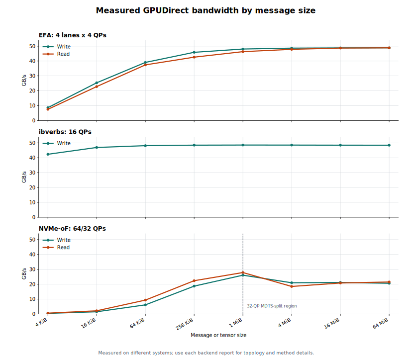
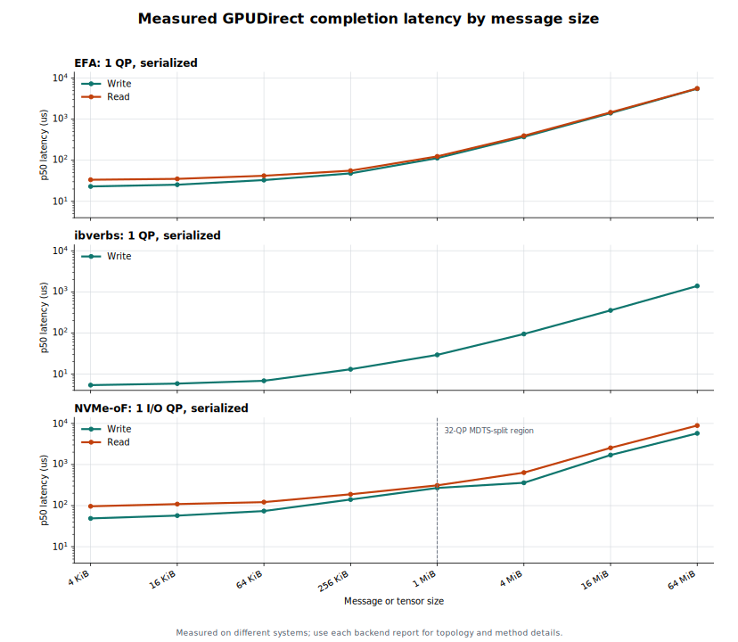

# GPUDirect benchmark overview

These charts summarize the measured configurations most representative of
each backend's intended use:

| Backend | Bandwidth configuration | Latency configuration | Detailed report |
|---|---|---|---|
| EFA | 4 physical lanes, 4 QPs per lane, depth 16 | 1 QP, depth 1 | [EFA benchmarks](efa/BENCHMARKS.md) |
| ibverbs | 16 RC QPs, depth 64 | 1 RC QP, serialized | [ibverbs benchmarks](ibverbs/BENCHMARKS.md) |
| NVMe-oF/RDMA | 64 QPs through 1 MiB; 32 QPs, depth 4 above MDTS | 1 I/O QP, serialized logical transfer | [NVMe-oF benchmarks](nvmeof/BENCHMARKS.md) |





The EFA results were measured on an AWS `p5.48xlarge`. The ibverbs and
NVMe-oF results were measured on a separate ConnectX-7/H100 system. They are
not a head-to-head hardware comparison. EFA and ibverbs transfer GPU to GPU;
NVMe-oF transfers between an NVMe-backed file namespace and GPU memory through
two distinct HCAs. Rates use decimal GB/s and sizes use binary units.

The SVGs are generated from the tables in the backend reports:

```bash
uv run --no-project --with matplotlib python benchmarks/plot_results.py
```
